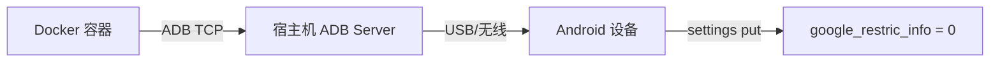

# fcmfix

通过 Docker 容器自动修复 Android 设备的 FCM（Firebase Cloud Messaging）推送问题。

## 背景

部分 Android 设备（尤其是国产 ROM）会默认禁用 Google FCM 推送服务，导致应用无法正常接收推送通知。本工具通过 ADB 自动将 `google_restric_info` 设置项从 `1`（受限）修改为 `0`（正常），从而恢复 FCM 推送功能。

> ⚠️ **注意**：目前仅针对 **OPPO** 设备有效，已测试通过 **OPPO Find X9**。其他品牌/型号暂未验证。

## 工作原理



1. 容器通过 `host.docker.internal` 连接到宿主机的 ADB Server（端口 5037）
2. 获取已连接的 Android 设备列表
3. 读取 `settings secure google_restric_info` 的当前值
4. 如果值为 `1`，自动修改为 `0` 并验证结果

## 前置条件

- 宿主机已安装 ADB 并可通过 `adb devices` 正常识别设备
- 宿主机已安装 Docker
- Android 设备已开启 **USB 调试** 并通过 USB 或无线方式连接到宿主机

## 快速开始

### 方式一：直接使用预构建镜像（推荐）

```bash
docker run --rm mrbruce516/fcmfix:oppo
```

如果你的 ADB Server 不在默认地址，可通过环境变量指定：

```bash
docker run --rm \
  -e ADB_HOST=192.168.1.100 \
  -e ADB_PORT=5037 \
  mrbruce516/fcmfix:oppo
```

### 方式二：本地构建

#### 1. 确保设备已连接

在宿主机上运行以下命令确认设备已连接：

```bash
adb devices
```

预期输出：

```
List of devices attached
XXXXXXXX    device
```

#### 2. 构建镜像

```bash
docker build -t fcmfix .
```

#### 3. 运行容器

```bash
docker run --rm fcmfix
```

## 环境变量

| 变量 | 默认值 | 说明 |
|------|--------|------|
| `ADB_HOST` | `host.docker.internal` | 宿主机 ADB Server 的 IP 地址 |
| `ADB_PORT` | `5037` | 宿主机 ADB Server 的端口 |

## 输出示例

**需要修复时：**

```
正在尝试连接宿主机的 ADB 服务 -> host.docker.internal:5037
成功对接宿主机上的无线设备: xxxxx
当前 google_restric_info 的值为: '1'
检测到值为 1，正在修改为 0...
🎉 fcm已修复，验证结果: '0'
```

**无需修复时：**

```
正在尝试连接宿主机的 ADB 服务 -> host.docker.internal:5037
成功对接宿主机上的无线设备: xxxxxx
当前 google_restric_info 的值为: '0'
fcm状态正常，无需修复✨
```

## 已测试设备

| 品牌 | 型号 | 状态 |
|------|------|------|
| OPPO | Find X9 | ✅ 通过 |

## Docker 镜像

预构建镜像已发布至 Docker Hub：

- `mrbruce516/fcmfix:oppo` — 针对 OPPO 设备的修复镜像

## 技术栈

- **Python 3.14+**
- **adbutils** - Python ADB 客户端库
- **Docker** - 容器化运行环境

## 许可证

MIT